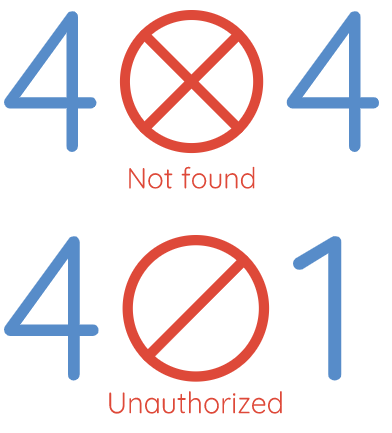

### docure-result

```js
npm i @specialdoom/docure-result
```

### usage

```html
<docure-button attribute></docure-result>
```

### attributes
Used to display the specific result. Use one of the attributes of the list below:
```html
<!-- 404 message -->
<docure-result notfound></docure-result>
<!-- 401 message -->
<docure-result unauthorized></docure-result>
```

### example 

